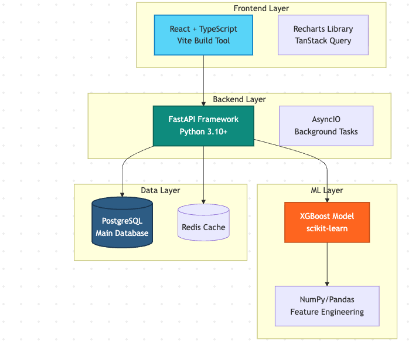
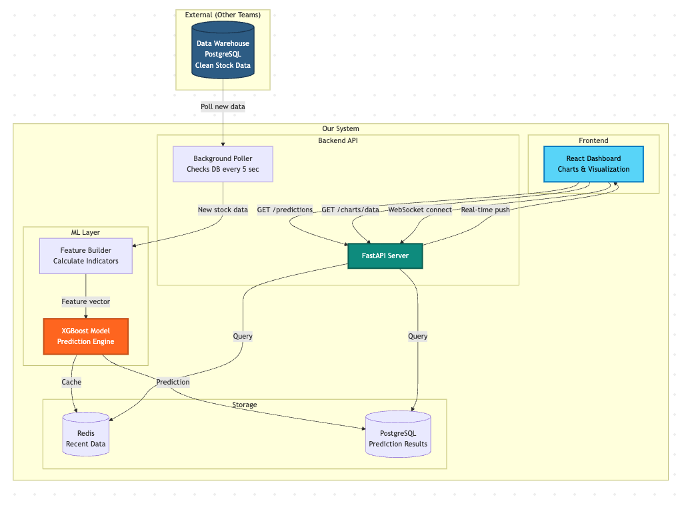
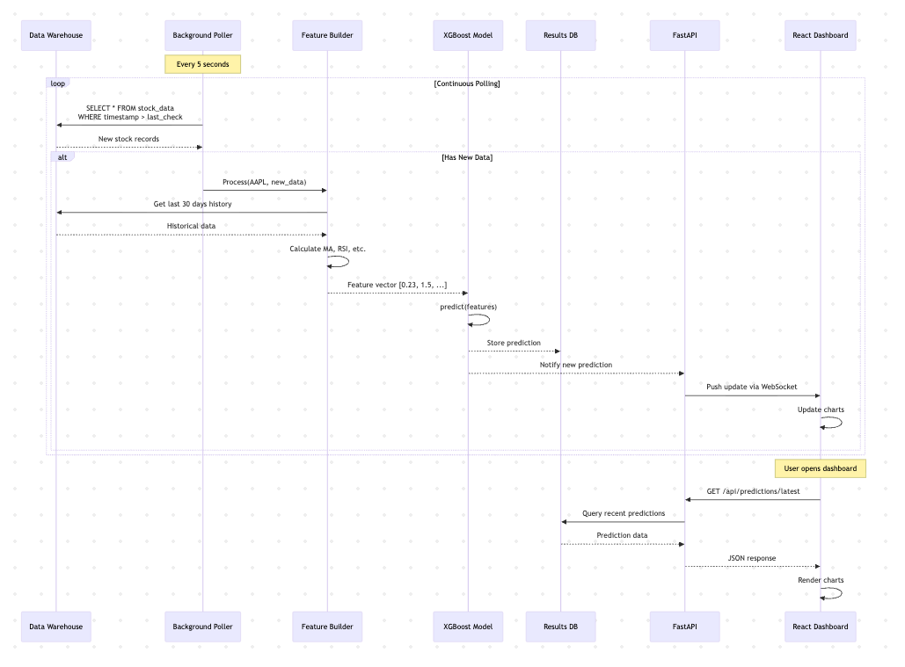

# Stock Market Prediction System 📈

> **Real-Time ML-Powered Stock Price Prediction Platform**

[](https://www.python.org/downloads/)
[](https://MarketSight.tiangolo.com/)
[](LICENSE)

A production-ready system that leverages XGBoost machine learning to provide real-time stock price predictions with live dashboard visualization. The system continuously monitors market data, calculates technical indicators, and generates predictions with confidence scores.

## Streamlit Frontend

The active frontend lives in `frontend_streamlit/`. The old React frontend is no longer part of the Docker stack.

For local development without Docker:

```bash
python -m venv .venv
source .venv/bin/activate
pip install -r frontend_streamlit/requirements.txt
API_BASE_URL=http://localhost:8000/api/v1 streamlit run frontend_streamlit/app.py
```

## 🌟 Key Features
- **Real-Time Predictions**: Automated polling (configurable interval) with sub-second inference.
- **Advanced Machine Learning**: XGBoost model trained on historical data with technical indicators (RSI, MACD, Bollinger Bands).
- **Interactive Dashboard**: Streamlit UI for predictions, charting, and simulation review.
- **Robust Backend**: FastAPI application with SQLAlchemy v2, Alembic migrations, and Pydantic v2 validation.
- **Enterprise-Grade Testing**: Comprehensive `pytest` suite covering API, CRUD, and ML inference with dedicated CI pipelines.
- **Developer Experience**: Dockerized backend/data services, Streamlit frontend, and `uv`-based Python workflows.

## 🏗️ System Architecture

### High-Level Components


- **Frontend**: Streamlit dashboard for charts, prediction review, and simulation playback.
- **Backend Service**: FastAPI. Handles REST API, WebSocket streaming (planned), and background data polling.
- **ML Engine**: XGBoost Regressor wrapped in a thread-safe Singleton `ModelManager`.
- **Database**: PostgreSQL (Application Data) + TimescaleDB ready (Market Data).

### Data Flow


1. **Ingestion**: Background tasks poll external data sources (mocked for dev).
2. **Processing**: `pandas` pipeline calculates technical indicators from OHLCV data.
3. **Inference**: XGBoost model predicts the next closing price.
4. **Persistence**: Predictions and actuals are stored in Postgres for accuracy tracking.
5. **Consumption**: Streamlit fetches data from the backend and renders charts and predictions.

### Use Cases


## 🛠️ Technology Stack

### Backend & ML
- **Framework**: FastAPI (Async)
- **Database**: PostgreSQL 16
- **ORM**: SQLAlchemy 2.0 (Async/Sync compatible)
- **Migrations**: Alembic (Auto-schema generation)
- **ML**: XGBoost, Scikit-Learn, Pandas, NumPy
- **Tooling**: `uv` (Package Manager), `ruff` (Linting), `mypy` (Type Checking)
- **Testing**: `pytest`, `httpx`

### Frontend
- **Framework**: Streamlit
- **Language**: Python
- **Visualization**: Plotly
- **HTTP Client**: Requests


## 📁 Project Structure

```
stock-prediction-system/
├── backend/                    # Python MarketSight backend
│   ├── app/
│   │   ├── main.py            # MarketSight application entry point
│   │   ├── poller.py          # Background polling service
│   │   ├── features.py        # Feature engineering pipeline
│   │   ├── model.py           # XGBoost model service
│   │   ├── database.py        # Database connection and models
│   │   ├── api/
│   │   │   ├── predictions.py # Prediction endpoints
│   │   │   ├── websocket.py   # WebSocket handler
│   │   │   └── health.py      # Health check endpoints
│   │   └── schemas/
│   │       └── prediction.py  # Pydantic models
│   ├── models/
│   │   └── xgboost_model.pkl  # Trained ML model
│   ├── tests/                 # Backend unit tests
│   ├── requirements.txt       # Python dependencies
│   └── Dockerfile
│
├── frontend_streamlit/         # Active Streamlit frontend
│   ├── app.py                  # Dashboard entry point
│   ├── api.py                  # Backend API client
│   ├── requirements.txt
│   └── README.md
│
├── docs/                       # Documentation
│   ├── images/                # Architecture diagrams
│   ├── API.md                 # API documentation
│   └── DEPLOYMENT.md          # Deployment guide
│
├── scripts/                    # Utility scripts
│   ├── seed_data.py           # Database seeding
│   └── test_model.py          # Model validation
│
├── docker-compose.yml          # Docker orchestration
├── .env.example               # Environment template
├── .gitignore
├── LICENSE
└── README.md
```

## 🔧 Configuration

### Environment Variables

Create a `.env` file with the following configuration:

```bash
# Database Configuration
POSTGRES_SERVER=db
POSTGRES_PORT=5432
POSTGRES_USER=postgres
POSTGRES_PASSWORD=changethis
POSTGRES_DB=predictions

# Data Warehouse Connection (External)
DWH_SERVER=datawarehouse.company.com
DWH_PORT=5432
DWH_USER=readonly_user
DWH_PASSWORD=secure_password
DWH_DB=stock_data

# Redis Configuration
REDIS_HOST=redis
REDIS_PORT=6379

# Model Configuration
MODEL_PATH=/app/models/xgboost_model.pkl
MODEL_VERSION=v1.0.0

# Polling Configuration
POLL_INTERVAL_SECONDS=5
HISTORICAL_WINDOW_DAYS=30

# API Configuration
API_HOST=0.0.0.0
API_PORT=8000
API_WORKERS=4

# Streamlit Configuration
API_BASE_URL=http://localhost:8000/api/v1
```

## 📡 API Documentation

### REST Endpoints

#### Get Latest Predictions

```http
GET /api/v1/predictions/latest?symbol=AAPL&limit=100
```

**Response:**
```json
{
  "data": [
    {
      "id": "550e8400-e29b-41d4-a716-446655440000",
      "symbol": "AAPL",
      "prediction_timestamp": "2025-01-27T10:30:00Z",
      "predicted_price": 185.50,
      "current_price": 184.70,
      "confidence_score": 0.85,
      "model_version": "v1.0.0"
    }
  ],
  "count": 150,
  "limit": 100
}
```

#### Get Chart Data

```http
GET /api/v1/charts/price-vs-prediction?symbol=AAPL
```

#### Health Check

```http
GET /api/v1/health
```

**Response:**
```json
{
  "status": "healthy",
  "database": "connected",
  "redis": "connected",
  "model_loaded": true,
  "model_version": "v1.0.0",
  "last_poll": "2025-01-27T10:30:15Z",
  "polling_lag_seconds": 2
}
```

### WebSocket

```javascript
// Connect to WebSocket
const ws = new WebSocket('ws://localhost:8000/ws/predictions');

// Listen for predictions
ws.onmessage = (event) => {
  const prediction = JSON.parse(event.data);
  console.log('New prediction:', prediction);
};
```

**Message Format:**
```json
{
  "type": "new_prediction",
  "data": {
    "symbol": "AAPL",
    "predicted_price": 185.50,
    "confidence": 0.85,
    "timestamp": "2025-01-27T10:30:00Z"
  }
}
```

## 🧪 Development Setup

### Backend Development

The backend uses [uv](https://docs.astral.sh/uv/) for fast dependency management. Install it first:

```bash
curl -LsSf https://astral.sh/uv/install.sh | sh
```

Then set up and run the backend:

```bash
cd backend

# Install dependencies (creates .venv automatically)
uv sync


# Run database migrations
# uv run alembic upgrade head

# Start development server with auto-reload
uv run fastapi dev app/main.py --host 0.0.0.0 --port 8000
```

You can also activate the virtual environment manually if you prefer:

```bash
source .venv/bin/activate
MarketSight dev app/main.py
```

### Frontend Development

```bash
cd frontend

# Install dependencies
npm install

# Start development server
npm run dev

# Run tests
npm test

# Build for production
npm run build
```

## 📊 Performance Metrics

| Metric | Target | Current |
|--------|--------|---------|
| API Response Time (p50) | <100ms | 80ms |
| API Response Time (p95) | <300ms | 250ms |
| Prediction Latency | <50ms | 35ms |
| WebSocket Latency | <10ms | 5ms |
| Cache Hit Ratio | >80% | 85% |
| Concurrent Users | 100+ | Tested at 150 |

## 🔒 Security

- **Input Validation**: All API inputs validated with Pydantic
- **SQL Injection Prevention**: Parameterized queries via SQLModel
- **CORS**: Configured for specific origins only
- **Rate Limiting**: API endpoints rate-limited per IP
- **Environment Variables**: Sensitive data in `.env` (not committed)

## 🧰 Monitoring & Logging

### View Logs

```bash
# All services
docker-compose logs -f

# Specific service
docker-compose logs -f backend
docker-compose logs -f frontend

# Last 100 lines
docker-compose logs --tail=100 backend
```

### Monitor Resources

```bash
# Container stats
docker stats

# Disk usage
docker system df
```

## 🚢 Deployment

### Production Deployment

```bash
# Build images
docker-compose build

# Start in production mode
docker-compose -f docker-compose.prod.yml up -d

# Scale backend instances
docker-compose -f docker-compose.prod.yml up -d --scale backend=3
```

### Cloud Deployment

Deployment guides available for:
- **AWS**: ECS with RDS and ElastiCache
- **Google Cloud**: GKE with Cloud SQL and Memorystore
- **Azure**: AKS with Azure Database for PostgreSQL

See `docs/DEPLOYMENT.md` for detailed instructions.

## 🧪 Development & Testing

### Backend Setup (Local)
We use `uv` for ultra-fast dependency management.

```bash
cd backend
# 1. Install dependencies
uv sync

# 2. Run Database Migrations (Crucial!)
#    This creates tables like 'market.stocks' in your local DB
uv run alembic upgrade head

# 3. Start Dev Server
uv run fastapi dev app/main.py --host 0.0.0.0
```

### Running Tests
The project includes a robust test suite covering API, DB, and ML logic.

```bash
# Run all backend tests
cd backend
uv run pytest tests/ -v

# Run linting (Ruff)
uv run ruff check .

# Run type checking (Mypy)
uv run mypy app
```

### Frontend Setup (Local)
```bash
cd frontend
# 1. Install dependencies (Bun)
bun install

# 2. Start Dev Server
bun run dev

# 3. Build for Production
bun run build
```

## 📈 Scaling

### Current Capacity
- **Users**: 100-500 concurrent
- **Predictions**: 1,000-5,000 per day
- **Deployment**: Single server

### Scaling Strategy

**Phase 2 (Next 6 Months)**
- 3x MarketSight instances behind load balancer
- PostgreSQL read replicas
- Redis cluster
- **Capacity**: 1,000 users, 10,000 predictions/day

**Phase 3 (1 Year)**
- Kubernetes auto-scaling
- Database partitioning
- Multi-region deployment
- **Capacity**: 10,000+ users, 100,000+ predictions/day

## 🤝 Contributing

We welcome contributions! Please see our [Contributing Guidelines](CONTRIBUTING.md).

### Development Workflow

1. Fork the repository
2. Create a feature branch (`git checkout -b feature/amazing-feature`)
3. Commit your changes (`git commit -m 'Add amazing feature'`)
4. Push to the branch (`git push origin feature/amazing-feature`)
5. Open a Pull Request

### Code Standards

- **Python**: Follow PEP 8, use Black formatter
- **TypeScript**: Follow Airbnb style guide, use ESLint
- **Commits**: Use conventional commits format
- **Tests**: Maintain >80% code coverage

## 🐛 Troubleshooting

### Common Issues

**Backend won't start:**
```bash
# Check logs
docker-compose logs backend

# Common fixes:
# - Wait 30s for database to be ready
# - Verify MODEL_PATH in .env
# - Check port 8000 not in use
```

**Frontend can't connect to API:**
```bash
# Verify VITE_API_URL in .env
# Rebuild frontend
docker-compose up -d --build frontend
```

**Database connection issues:**
```bash
# Verify database is running
docker-compose ps db

# Test connection
docker-compose exec backend python -c "from app.database import engine; print(engine)"
```

## 📚 Documentation

- **[API Documentation](docs/API.md)** - Detailed API reference
- **[Deployment Guide](docs/DEPLOYMENT.md)** - Production deployment
- **[Architecture Deep Dive](docs/ARCHITECTURE.md)** - System design details
- **[Contributing Guidelines](CONTRIBUTING.md)** - How to contribute
- **[Technical Documentation (PDF)](docs/Technical_Documentation.pdf)** - Complete technical specs

## 📝 License

This project is licensed under the MIT License - see the [LICENSE](LICENSE) file for details.

## 👥 Team

- **Lead Developer**: [@username](https://github.com/Harshksaw)


## 🙏 Acknowledgments

- XGBoost team for the excellent gradient boosting library
- MarketSight community for the amazing framework
- React team for the powerful UI library
- All our contributors and supporters

## 📞 Support

- **Issues**: [GitHub Issues](https://github.com/your-org/stock-prediction-system/issues)
- **Discussions**: [GitHub Discussions](https://github.com/your-org/stock-prediction-system/discussions)
- **Email**: support@yourcompany.com

---

**Built with ❤️ by the Stock Prediction Team**

*Last Updated: January 2025*
