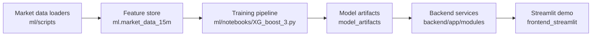

# ML and Simulation Docs

This folder contains the market-data, feature-engineering, training, inference, and replay documentation for Project Maverick.

Use this page as the ML documentation index when you need a presentation-friendly entrypoint.

## Start Here

- [Project overview](/home/cosc-admin/the-project-maverick/README.md) for the full stack: Postgres, FastAPI, Streamlit, and model artifacts.
- [April 7 simulation note](/home/cosc-admin/the-project-maverick/ml/SIMULATION_APRIL7.md) for the current replay workstream.
- [XGBoost handoff](/home/cosc-admin/the-project-maverick/Documentation/xgboost3_handoff.md) for deeper model and artifact background.
- Demo walkthrough video: `https://www.loom.com/share/07f7584445dd41d389e720bd053ae7ea`

## What This Area Covers

- Historical 15-minute market data in `ml.market_data_15m`
- Feature generation used by the XGBoost pipeline
- Base model training and artifact generation
- Prediction and replay/simulation workflows
- Backend artifact loading for live inference and demo playback

## System View

## Demo Story

1. Data is loaded and quality-checked into the 15-minute feature store.
2. The XGBoost pipeline trains 26 horizon-specific models for the next trading session path.
3. Saved artifacts are used by backend inference and replay/simulation endpoints.
4. Streamlit presents the predictions, charts, and playback views.

## Key Docs

| Doc | Purpose |
| --- | --- |
| [SIMULATION_APRIL7.md](/home/cosc-admin/the-project-maverick/ml/SIMULATION_APRIL7.md) | Focused note for the April 7 replay workstream |
| [xgboost3_handoff.md](/home/cosc-admin/the-project-maverick/Documentation/xgboost3_handoff.md) | Technical handoff for the current XGBoost pipeline |
| [Developers_Guide.md](/home/cosc-admin/the-project-maverick/Documentation/Developers_Guide.md) | Developer-oriented project reference |
| [Installation_Guide.md](/home/cosc-admin/the-project-maverick/Documentation/Installation_Guide.md) | Local setup guide |
| [User_Manual.md](/home/cosc-admin/the-project-maverick/Documentation/User_Manual.md) | End-user workflow and application reference |

## Key Paths

| Path | Role |
| --- | --- |
| `ml/notebooks/XG_boost_3.py` | Main training, prediction, and replay pipeline |
| `ml/scripts/refetch_market_data_15m_quality.py` | Bulk backfill and quality-check workflow |
| `ml/features/technical_indicators.py` | Feature engineering helpers |
| `backend/app/modules/inference/` | Live inference artifact loading and serving |
| `backend/app/modules/simulation/` | Replay/simulation artifact loading and serving |
| `model_artifacts/` | Saved training and replay outputs used by the app |

## Current Focus

The current headline work is not a new architecture; it is presentation and operational polish around the existing one. The April 7 replay is one demo slice of the broader ML system, alongside training, inference, and artifact-backed backend delivery.
